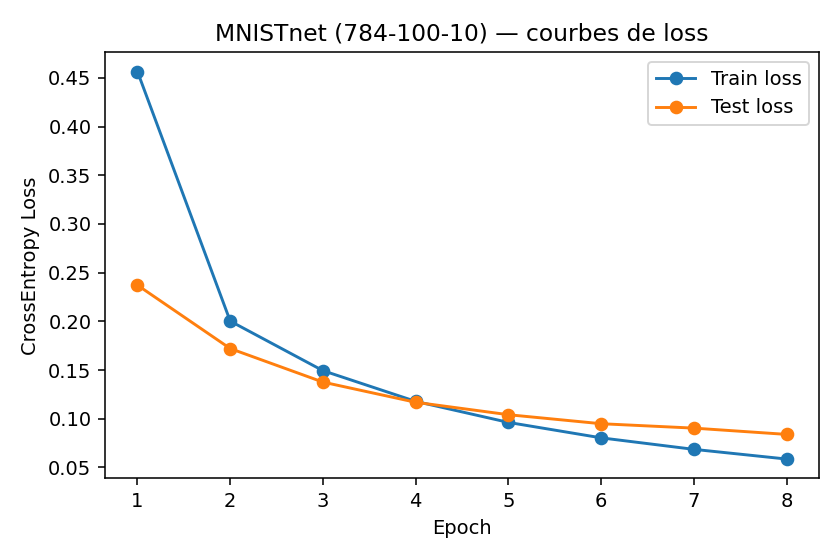
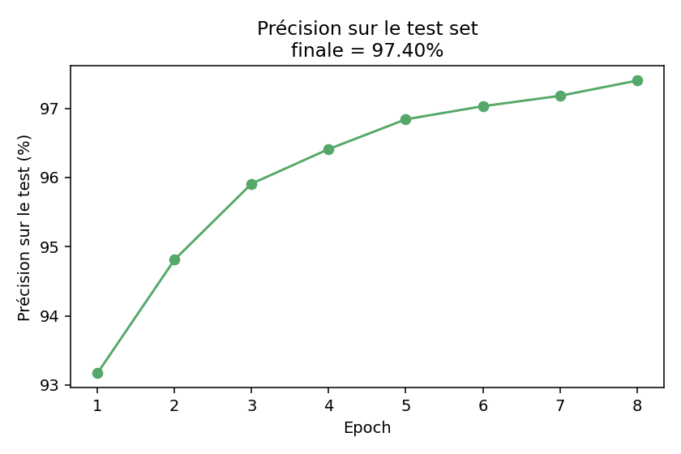
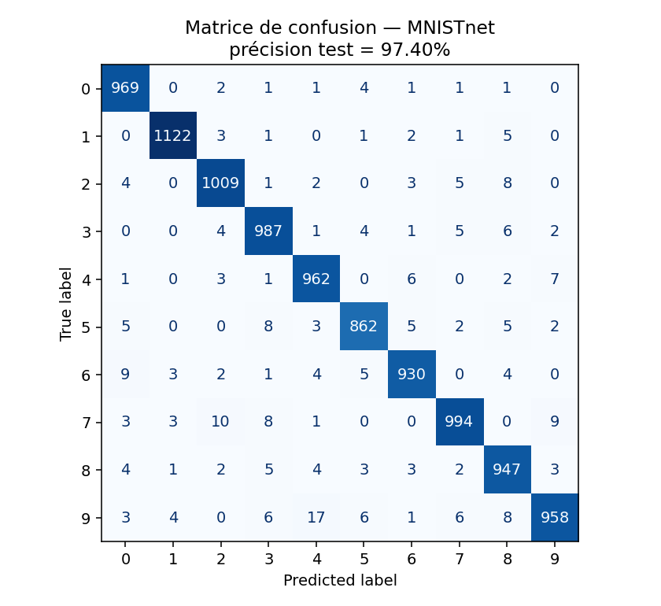
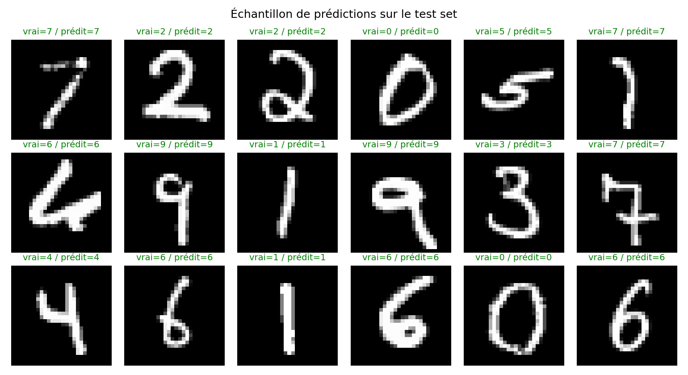

# Handwritten Digit Classification with PyTorch

> Academic machine learning notebook for classifying handwritten digits from the MNIST dataset using a fully connected neural network in PyTorch.

## Project Overview

This project demonstrates a complete introductory deep learning workflow: loading the MNIST dataset, preprocessing image tensors, building a neural network, training the model, and evaluating classification performance.

The notebook was developed as part of academic practical work in machine learning.

## Dataset

The project uses the **MNIST** handwritten digit dataset, downloaded automatically through `torchvision.datasets.MNIST`.

## Technologies

| Category | Tools |
|---|---|
| Language | Python |
| Notebook | Jupyter / Google Colab |
| Deep Learning | PyTorch, TorchVision |
| Data Processing | NumPy |
| Visualization | Matplotlib |

## Model

A fully-connected network (784 → 100 → 10) with a Sigmoid hidden activation, trained with Adam (lr=1e-3) and cross-entropy loss, batch size 32, for 8 epochs.

## Results

The model reaches **97.4% accuracy** on the MNIST test set after 8 epochs, with loss decreasing smoothly on both train and test sets (no overfitting at this scale):





The confusion matrix shows very few mistakes, mostly between visually similar digits (4/9, 3/5, 7/9):



A random sample of predictions on the test set, label in green when correct:



## Repository Structure

```text
handwritten-digit-classification-pytorch/
├── README.md
├── LICENSE
├── requirements.txt
├── .gitignore
├── assets/
│   ├── loss_curve.png
│   ├── accuracy_curve.png
│   ├── confusion_matrix.png
│   └── sample_predictions.png
└── notebooks/
    └── mnist_fully_connected_network.ipynb
```

## How to Run

```bash
pip install -r requirements.txt
jupyter notebook notebooks/mnist_fully_connected_network.ipynb
```

The dataset will be downloaded automatically when the notebook is executed.

## Skills Demonstrated

- Neural network training with PyTorch
- Image classification workflow
- Tensor manipulation and preprocessing
- Reproducible experiments with random seeds
- Model evaluation in Jupyter Notebook

## Author

**Manassé Makuikila Lusaku**

## License

MIT License
